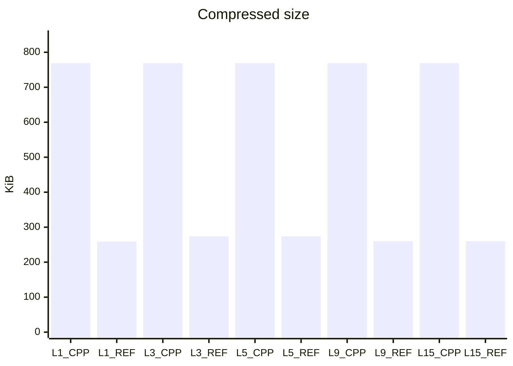
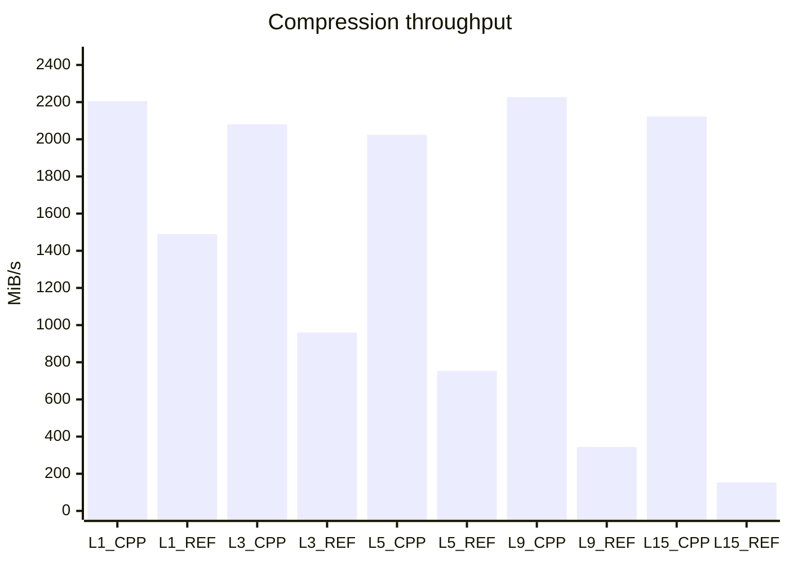
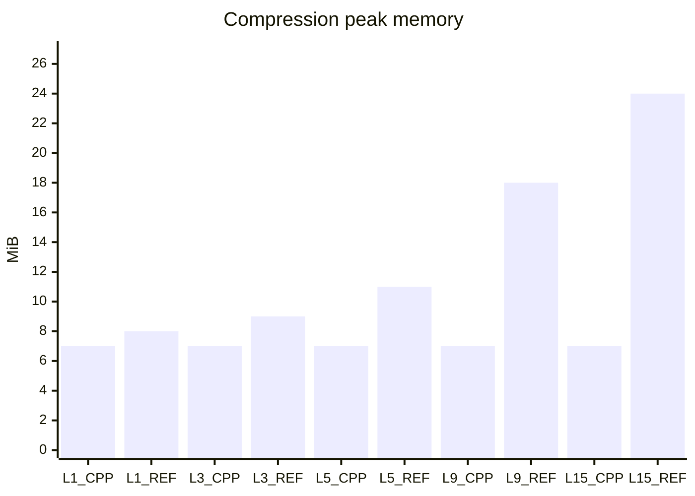
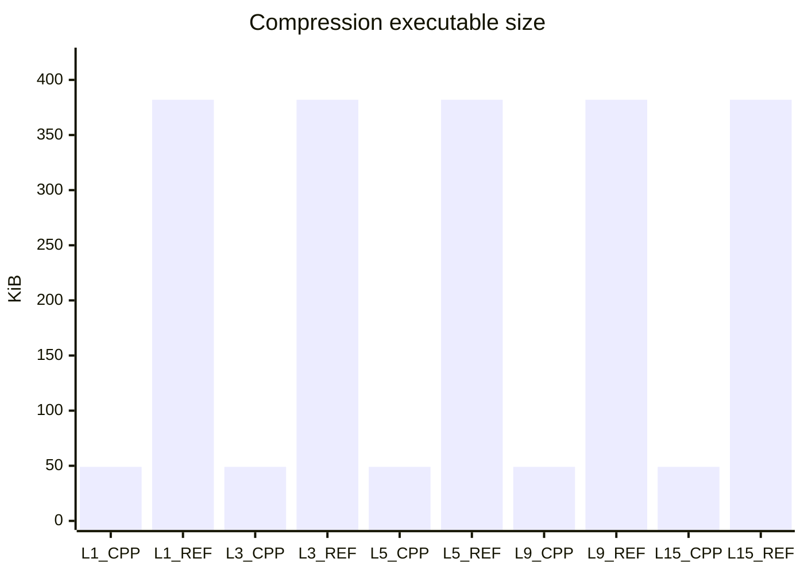
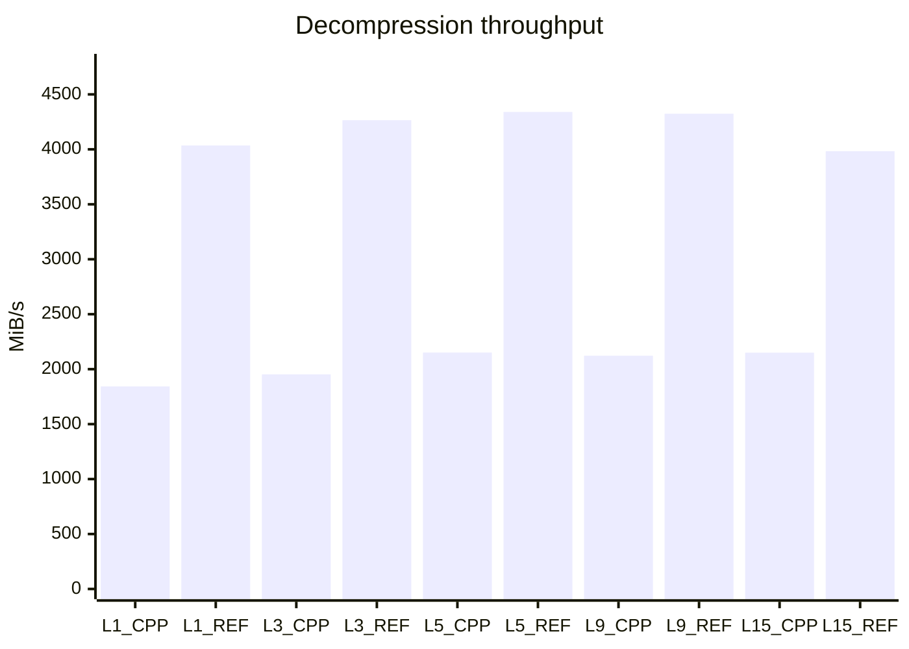
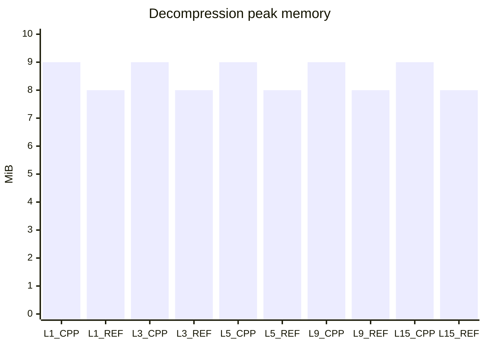
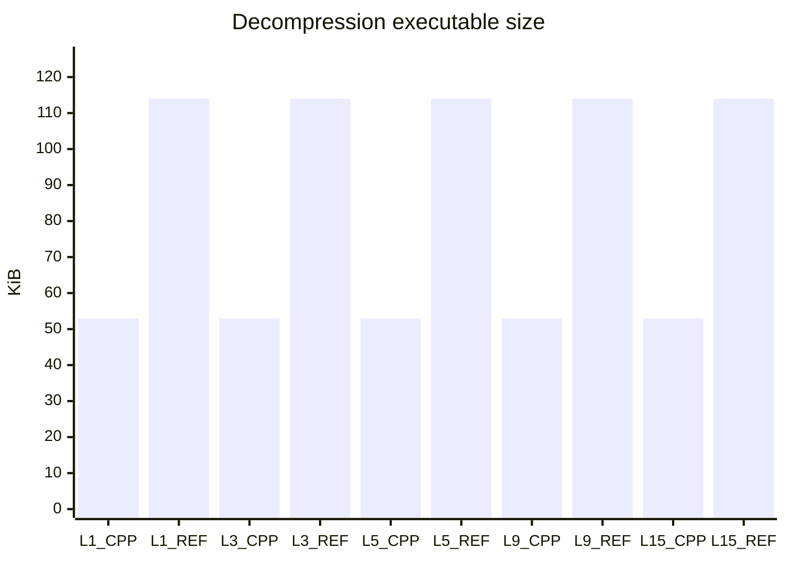

# sph-zstd++

A header-only C++23 Zstandard implementation built around compile-time configuration and
callback-driven streaming. The project is an incremental C++ port of the reference implementation
in `reference_zstd`.

## Interface

Both streams accept any callback invocable with `std::span<std::uint8_t const>`. The callback span
is valid for the duration of that invocation. Call `finish()` explicitly to complete or validate a
stream; destructors do not perform hidden output operations.

```cpp
#include <sph/zstd++/zstd.h>

#include <cstdint>
#include <array>
#include <span>
#include <vector>

std::vector<std::uint8_t> compressed;
auto compressor = sph::zstd::zstd_compress{
    [&compressed](std::span<std::uint8_t const> bytes)
    {
        compressed.insert(compressed.end(), bytes.begin(), bytes.end());
    }};

std::array<std::uint8_t, 3> const input{1, 2, 3};
compressor.update(std::uint8_t{42});
compressor.update(input);
compressor.finish();
```

Compile-time options use a structural non-type template parameter. The helper preserves the
callback's concrete type so it can be inlined:

```cpp
constexpr auto checked = []
{
    auto options = sph::zstd::compression_parameters{};
    options.checksum = true;
    options.window_log = 20;
    return options;
}();

auto compressor = sph::zstd::make_zstd_compress<checked>(callback);
```

Useful stream operations and observations currently include `update(span)`, `update(byte)`,
`flush()` (compression), `finish()`, `reset()`, `status()`, byte counters, completed frame count,
and parsed frame information.

## Port status

The current working slice provides:

- valid standard and magicless frame headers;
- streaming raw and RLE compression;
- raw and RLE decompression;
- compressed blocks containing raw/RLE literals and zero match sequences;
- content-size fields and XXH64 content checksums;
- concatenated and skippable frames;
- explicit truncation, checksum, size, format, and state errors;
- interoperability tests against the downloaded reference library; and
- unmodified reference golden-frame tests for RLE and zero-sequence blocks.

The next porting layers are Huffman literal decoding, FSE sequence decoding, match execution with a
bounded history window, and then the compression match finders and entropy encoders. Dictionary and
multi-threaded modes are intentionally rejected until their implementations exist.

## Build and test

```text
cmake -S . -B out/build -DSPH_ZSTDPP_BUILD_TESTS=ON
cmake --build out/build
ctest --test-dir out/build --output-on-failure
```

Tests compile with warnings-as-errors on MSVC, Clang, and GCC-style frontends. The public
`sph::zstdpp` CMake target is header-only and does not link the reference implementation; only the
interoperability test target does.

### Presets and reference builds

Compiler-specific presets are provided for MSVC, Clang, and GCC. Reference presets expose and build
the downloaded `libzstd_static` target without enabling the C++ tests or evaluation matrix:

```text
cmake --preset msvc-release-reference
cmake --build --preset msvc-release-reference
```

Replace `msvc` with `clang` or `gcc` where appropriate. Evaluation presets build twenty isolated
workers—compression and decompression for each implementation at levels 1, 3, 5, 9, and 15—plus
the controller:

```text
cmake --preset msvc-release-eval
cmake --build --preset msvc-release-eval
cmake --build --preset msvc-run-eval
```

The final command validates every worker, writes `metrics.csv` and a graphical `METRICS.md` beside
it beneath the preset's build directory, and replaces the marked evaluation section below. The controller accepts
`--iterations`, `--output`, and `--readme` overrides when invoked directly.

<!-- SPH_ZSTDPP_EVAL_BEGIN -->

## Current evaluation

Generated by `zstdpp_eval` using **MSVC 19.51.36256.0**, Release, 20 timed iterations, and a deterministic 1 MiB mixed corpus. **Key: `CPP` is sph-zstd++; `REF` is reference zstd.** Each compression-level pair is displayed side-by-side with the C++ value first. Code size is the complete worker executable; memory is peak resident set size, so both intentionally include runtime overhead.

Compression workers receive identical input. Decompression workers both consume the same sph-zstd++-generated frame at each level because general reference-compressed blocks are not supported by the C++ decoder yet.

### Compression









### Decompression







<!-- SPH_ZSTDPP_EVAL_END -->


